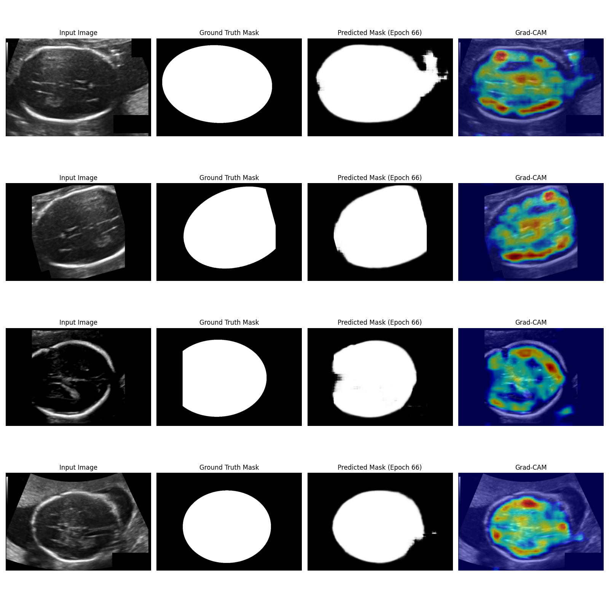
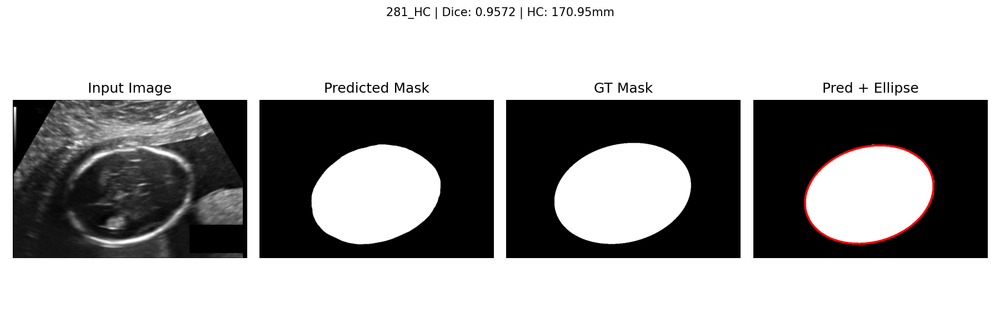

# Fetal Head Circumference Estimation from Ultrasound Images

This repository provides a pipeline for preprocessing, training, and evaluating deep learning models to estimate fetal head circumference (HC) using segmentation from ultrasound images.

## Overview

The pipeline includes data preprocessing, model training with k-fold cross-validation, evaluation metrics (Dice coefficient) and (MAE) For HC measurements, and visualization tools like Grad-CAM for model interpretability. It is designed for researchers and developers working on medical imaging and fetal ultrasound analysis.

## Directory Structure

```
├── models/                         # Trained models and checkpoints
│   ├── checkpoint/                 # Model checkpoints
│   └── model.py                    # Model architecture
├── notebooks/                      # EDA and visualizations
│   ├── animation.gif               # Animation of intermediate model outputs
│   └── exploratory_data_analysis.ipynb  # Exploratory data analysis
├── scripts/                        # Helper scripts
│   ├── data.py                     # Data loading utilities
│   ├── early_stop.py               # Early stopping implementation
│   ├── grad_cam_tgt.py             # Grad-CAM visualization
│   ├── loss.py                     # Custom loss functions
│   └── prepare_datasets.py         # Data preprocessing script
├── src/                            # Raw and processed data
│   ├── training_set/               # Raw training images and annotations
│   ├── test_set/                   # Raw test images and annotations
│   ├── generated_training_set/     # Preprocessed training data (.npy)
│   ├── generated_test_set/         # Preprocessed test data (.npy)
│   ├── train_generated.csv         # Training metadata
│   ├── test_generated.csv          # Test metadata
│   └── training_set_pixel_size_and_HC.csv  # Pixel size and HC metadata
├── visuals/                        # Fold-wise visual outputs
│   ├── fold_1/ to fold_5/          # Visualizations per fold during evalutions
├── trainer.py                      # Main Starting Point For Training
├── config.py                       # Central configuration
├── evaluate.py                     # Evaluation script
├── learnings.txt                   # Notes and observations
├── README.md                       # This file
├── requirements.txt                # Python dependencies
└── settings.py                     # Setting Deterministics And Devices
```

## Getting Started

### Prerequisites

- Python 3.8+
- Virtual environment (recommended)
- CUDA-enabled GPU (optional, for faster training)

### Installation

1. Clone the repository:
   ```bash
   git clone https://github.com/Rochakdh/HC18US.git
   cd HC18US
   ```

2. Create and activate a virtual environment:
   ```bash
   python3 -m venv venv
   source venv/bin/activate  # On Windows: venv\Scripts\activate
   ```

3. Install dependencies:
   ```bash
   pip install -r requirements.txt
   ```

### Data Preprocessing

Run the preprocessing script to convert raw images and annotations into `.npy` format:
```bash
python scripts/prepare_datasets.py
```

**Input**: `src/training_set/`, `src/test_set/`  
**Output**: `generated_training_set/`, `generated_test_set/`, `train_generated.csv`, `test_generated.csv`

Train Set needs to have both ultraound Image and Ground Truth(with _Annotation). Follow the dataset downloaded form HC18 challenge.


**Preprocessing Steps**:
- Resize images and masks to 800x540
- Normalize pixel intensity
- Fill holes in binary masks
- Save as `.npy` arrays

### Configuration

Edit `config.py` to customize training parameters:
```python
DEVICE = "cuda:0"
BATCH_SIZE = 4
NUM_EPOCHS = 100
LEARNING_RATE = 0.0001
FOLD = 5
DROPOUT = 0.3
...
```

### Training

Train the model with:
```bash
python trainer.py
```

**Features**:
- K-fold cross-validation
- Early stopping
- Model checkpointing
- GradCAMS Visualization

### Evaluation

Evaluate the model performance:
```bash
python evaluate.py
```

**Outputs**:
- Predictions saved in `predicted_mask/`
- Metrics: Dice coefficient, IoU

### Visualization

- Visual results are saved in `visuals/fold_1/` to `visuals/fold_5/`.
- Explore `animation.gif` for intermediate learning of modeks by execting cell on`notebooks/exploratory_data_analysis.ipynb` for insights
- Intremediate results during model learning will be stored on `predicted_mask` folder in root folder.


## Results

Below are visual results showcasing the model's performance in segmenting fetal head circumference from ultrasound images.

### Learning Example at Fold 5, 66th Epoch

This image shows the model's segmentation output on a sample from fold 5 at the 66th epoch during training.

### Test Evaluation Visuals

Test evaluation image 1 from fold 5, demonstrating the model's segmentation and ellipse fitting on a test set sample.


## Citation

If you use this codebase, please cite:
```
@misc{fetal_hc_estimation_2025,
  title = {Fetal Head Circumference Estimation from Ultrasound Images},
  author = {Rocha Dhakal},
  year = {2025},
  url = {https://github.com/Rochakdh/HC18US}
}
```

## Contributing

Feel free to open issues or submit pull requests for suggestions, bug fixes, or improvements.

## Contact

For questions, please open an issue on GitHub.
